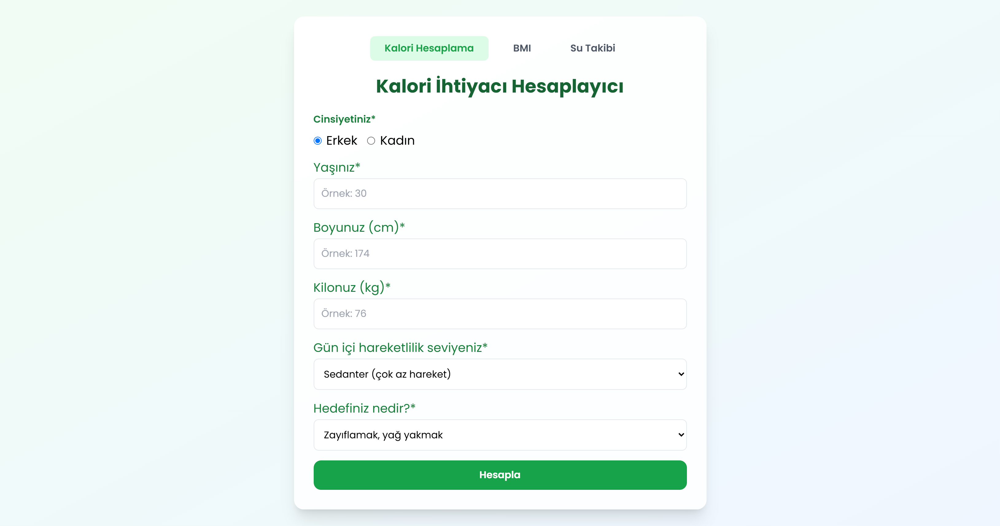

# 🍽️ Sağlıkli Yaşam Asistanı

Bu uygulama, günlük kalori takibi ve sağlıklı yaşam için 🎯 modern bir web uygulamasıdır.

## 🚀 Özellikler

- 📝 Günlük yemek takibi
- 📊 Kalori hesaplama
- 📋 BMI Hesaplama
- 📈 Su takibi
- 🔄 Kolay kullanım arayüzü
- 🎨 Modern ve kullanıcı dostu tasarım

## 📸 Ekran Görüntüleri

## 💻 Kurulum

1. 📥 Projeyi klonlayın
2. 📦 `npm install` komutunu çalıştırın
3. 🚀 `dist>styles.css dosyasını oluşturun.`
3. 🚀 `index.html dosyasını styles.css dosyasına bağlayın `
4. 🚀 `npm run watch:sass` ile uygulamayı başlatın

**Not:** `npm run watch:sass` komutu Tailwind CSS'i derleyecek ve sürekli olarak değişiklikleri izleyecek.

## 🔧 Teknolojiler

- 📝 HTML5
- 🎨 CSS3
- ⚡ JavaScript
- 🎨 Tailwind CSS (CDN)
- 🔄 Live Server

## 🔗 Canlı Demo

Uygulamayı GitHub Pages üzerinden görüntüleyebilirsiniz: [https://thisisburak.github.io/saglikli-yasam-asistani/](https://thisisburak.github.io/saglikli-yasam-asistani/)

## 📝 Lisans

ISC License
