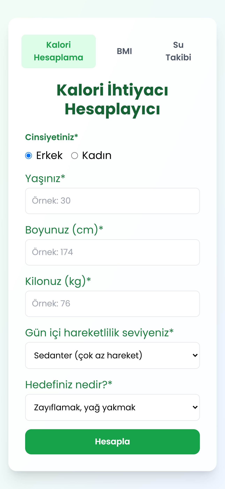

# 🍽️ Kalori Takip Uygulaması

Bu uygulama, günlük kalori takibi yapmanıza yardımcı olan 🎯 modern bir web uygulamasıdır.

## 🚀 Özellikler

- 📝 Günlük yemek takibi
- 📊 Kalori hesaplama
- 📋 Yemek listesi
- 📈 Günlük toplam kalori hesaplama
- 🔄 Kolay kullanım arayüzü
- 🎨 Modern ve kullanıcı dostu tasarım

## 📸 Ekran Görüntüleri

## 💻 Kurulum

1. 📥 Projeyi klonlayın
2. 📦 `npm install` komutunu çalıştırın
3. 🚀 `npm run watch:sass` ile uygulamayı başlatın

## 🔧 Teknolojiler

- 📝 HTML5
- 🎨 CSS3
- ⚡ JavaScript
- 🎨 Tailwind CSS
- 🔄 Live Server

## 📝 Lisans

ISC License
